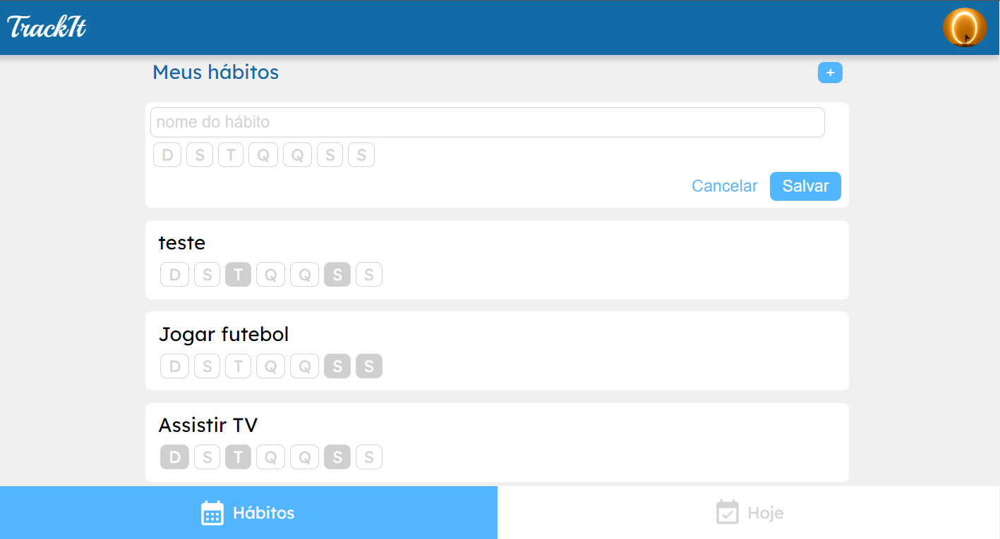
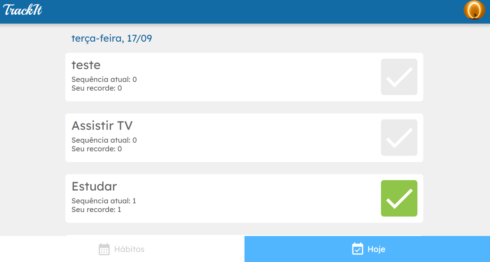

# TrackIt

Construa hábitos consistentemente!
## https://projeto-cineflex-phi.vercel.app/

## Screenshots




## Funcionalidades

- Crie sua conta
- Crie hábitos
- Acompanhe seu progresso!

## Rodando localmente

Clone o projeto

```bash
  git clone https://github.com/erickdesant/projeto-trackit
```

Entre no diretório do projeto

```bash
  cd my-project
```

Instale as dependências

```bash
  npm install
```

Inicie o servidor

```bash
  npm run dev
```

